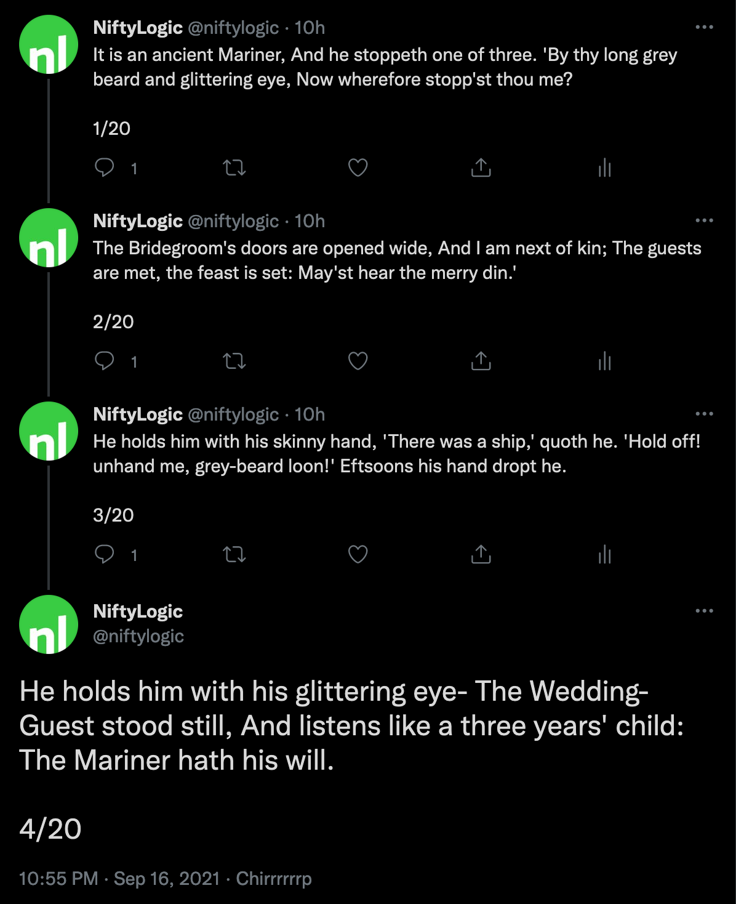

STORM
=====

This is a small Twitter application, written in Common Lisp, that
takes longform text (with optional media references) and slices it
up into numbered tweets, threads them, and spaces them out to
emulate typists of varying speeds.

For this to work, you need to get [chirp][chirp] spun up with a
custom application, and authenticated to the Twitter account you
want to send tweets as.

[chirp]: https://github.com/Shinmera/chirp


Storm In Action
---------------

Let's say you wanted to tweet out part 1 of _Rime of the Ancient
Mariner_.  You could start with a plaintext file that looks
[a bit like this][rime]:

[rime]: examples/rime-of-the-ancient-mariner.tweet

```
It is an ancient Mariner,
And he stoppeth one of three.
'By thy long grey beard and glittering eye,
Now wherefore stopp'st thou me?

The Bridegroom's doors are opened wide,
And I am next of kin;
The guests are met, the feast is set:
May'st hear the merry din.'

He holds him with his skinny hand,
'There was a ship,' quoth he.
'Hold off! unhand me, grey-beard loon!'
Eftsoons his hand dropt he.
```

and Storm will tweet that out, a few tweets a minute, like this:



(Here's the [original thread, on Twitter][nl], for posterity)

[nl]: https://twitter.com/niftylogic/status/1438697077177999366


Running Storm
-------------

_There's a tweetstorm a-brewin'..._

Storm is fully dockerized.  Out-of-the-box, the
[iamjameshunt/storm][img] does the following:

  1. Read and write configuration from `/etc/storm/settings`,
  2. Watch `/tweets` for files named `*.tweet`, and
  3. Tweet those files at 10 words per minute

This means you usually want to mount in volumes for those, either
named Docker volumes or (more preferred) bind-mount directories,
à la:

```sh
docker run -v /srv/storm/etc:/etc/storm \
           -v /srv/storm/tweets:/tweets \
           iamjameshunt/storm
```

While configuration is _stored_ in /etc/storm, out of the box,
there won't be any configuration to read.  In this mode, Storm is
operating **unauthenticated**.

You can fix this by either creating a settings file manually, like
this:

```sh
cat > /srv/storm/etc/settings <<EOF
((api-key       . "YOUR-API-KEY")
 (api-secret    . "YOUR-API-SECRET")
 (access-token  . "OAUTH-ACCESS-TOKEN")
 (access-secret . "OAUTH-ACCESS-SECRET"))
EOF
```

or, by Swank (via Emacs SLIME, or some other route) to connect to
the live REPL (read-eval-print loop) running inside of the
container.

(emacs gif)

For this to work, you need to be forwarding the container's
TCP/4005 port to something reachable.  For local dev, this works:

```sh
docker run -p 40050:4005 iamjameshunt/storm
```

For remote work, I normally recommend forwarding _only_ on
localhost / loopback, and setting up an SSH tunnel to protect the
Swank connection:

```sh
james@prod # docker run -d -p 127.0.0.1:40050:4005 \
                        iamjameshunt/storm

james@laptop $ ssh -N james@prod -L 40050:127.0.0.1:40050

james@laptop $ emacs   # M-x slime-connect etc...
```

Once you are connected to the container's REPL, you can issue the
following Common Lisp calls to kick off authentication,
interactively:

```lisp
CL-USER> (chirp:initiate-authentication
            :api-key    "YOUR-API-KEY"
            :api-secret "YOUR-API-SECRET")
"https://twitter-auth-url-or-something/?AAAAzg12h3gjhasd"

CL-USER> (chirp:complete-authentication "PIN-FROM-BROWSER")

CL-USER> (save-chirp-auth)
```

From then on (assuming the `/etc/storm` directory persists across
container restarts) everything should **Just Work**(TM).


Fun Things You Can Do In The REPL
---------------------------------

Connecting remotely to the live console of the SBCL REPL unlocks a
whole extra mode of dealing with a running application that you
may not be altogether familiar with or comfortable with.  I know I
wasn't at first.

Here's some ideas of what you can do.  These code listings all
assume you are connected (securely!) to your storm instance.

### Tune Your Words-per-Minute Speed

If Storm is tweeting out too quickly or too slowly, you can easily
adjust things by setting the `*wpm*` (dynamic) variable.

To speed things up:

```lisp
CL-USER> (setf *wpm* 80)
```

or, to slow them down:

```lisp
CL-USER> (setf *wpm* 5)
```

When you're connected to the REPL, you are actually _inside_ the
execution- and memory-space of the storm instance.  Changing
variables in the REPL affects the full machinery of storm, and
your changes **will** persist after your Swank client disconnects!

### See What's Going On (Stats!)

Storm defines a few functions made explicitly for use in the REPL.
`WHATS-UP` is one of those.  It shows you current stats:

```lisp
CL-USER> (whats-up)
4 storms.
39 tweets sent.
6 media uploaded.
```

These update in real-time, as storm sends out tweets and images.


### Send a Tweet, Off the Cuff

Don't have access to the `/tweets` directory in the container (or
whatever you mapped it to outside the container)?  No problem!

The `TWEET` function does what you'd think.  It sends a tweet.

```lisp
CL-USER> (tweet "Is this thing on?")
```

[img]: https://hub.docker.com/r/iamjameshunt/storm
